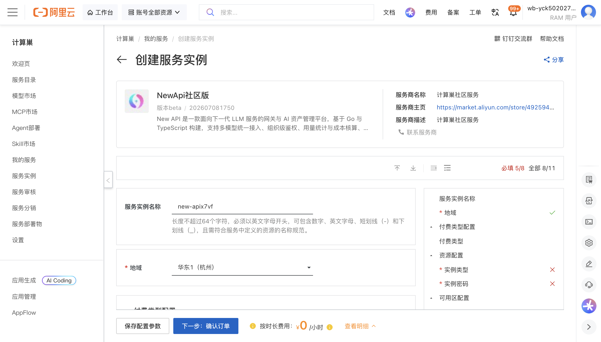
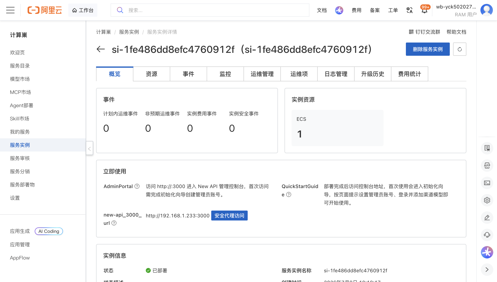
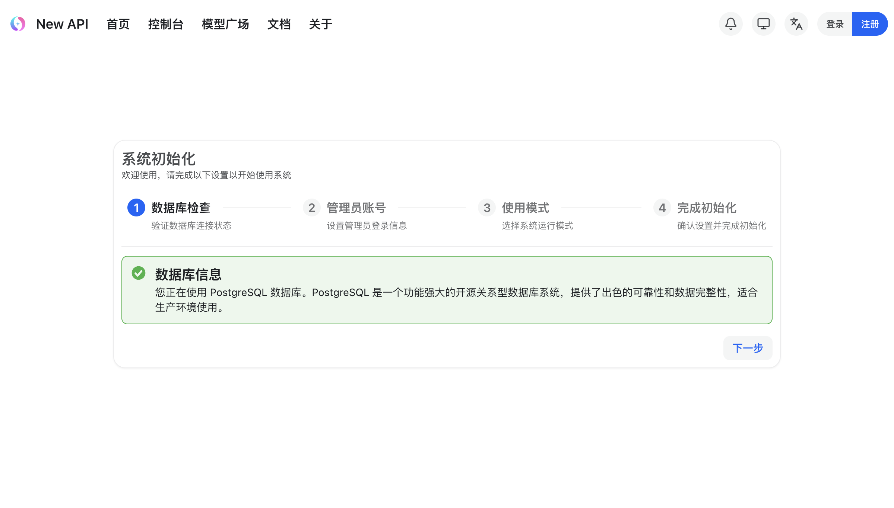

# NewApi社区版 部署文档

## 概述

NewApi社区版 是一款开源的 AI 网关与 API 管理平台，支持多种大语言模型（如 OpenAI、Claude、Gemini 等）的统一接入与代理，提供 Token 计费、用户管理、渠道管理等功能，方便团队或个人统一管理和使用 AI API。通过阿里云计算巢服务，您可以快速部署 NewApi社区版，实现开箱即用。

## 部署流程

### 1. 创建服务实例

访问 NewApi社区版 服务部署链接，按提示填写部署参数：

[部署链接](https://computenest.console.aliyun.com/service/instance/create/cn-hangzhou?type=user&ServiceId=service-82776be9323047f29a9c)

### 2. 确认订单并创建

参数填写完成后可以看到对应询价明细，确认参数后点击 **下一步：确认订单**。确认订单完成后同意服务协议并点击 **立即创建** 进入部署阶段。

### 3. 等待部署完成

等待部署完成后进入服务实例管理，在控制台找到 NewApi社区版 访问链接。

### 4. 访问服务

单击链接访问服务，首次访问将进入系统初始化向导，按提示完成初始化配置即可开始使用。

## 官方文档

更多信息请访问官方文档：[New API GitHub 仓库](https://github.com/QuantumNous/new-api)

### 使用须知
本工具为第三方开源项目，阿里云仅提供云资源和部署入口支持，不对工具自身功能、生成内容、执行结果、服务可用性及额外费用承担责任。
